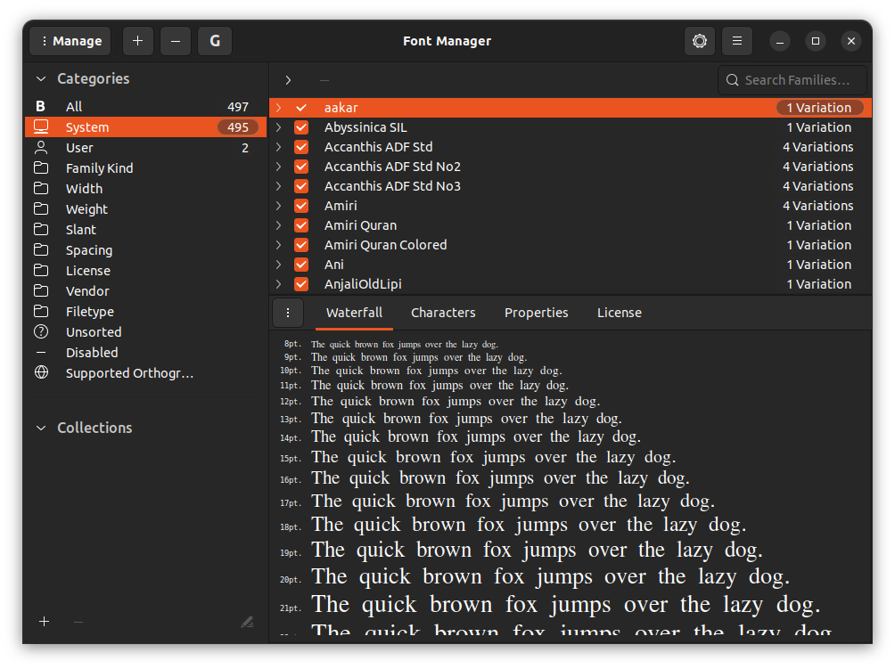

# Setup font family by font manager

## Download and Install font manager
```sh
sudo apt install font-manager
```

## Use font manager to install font family
Download font `.ttf` file and use font manager to add to the system.


## Some font family links:
1. [Times New Roman](https://www.download-free-fonts.com/details/86463/times-new-roman)
2. [Consolas](https://www.download-free-fonts.com/details/95277/consolas)
3. [KaiTi](https://github.com/hadziq/ntust-thesis/blob/master/%E4%B8%AD%E6%96%87%E7%89%88%E6%9C%AC/%E6%A8%99%E6%A5%B7%E9%AB%94.ttf)(default in Ubuntu 22.04. Name is KaitiM big5)

# Reference
1. [Download Free Fonts](https://www.download-free-fonts.com)