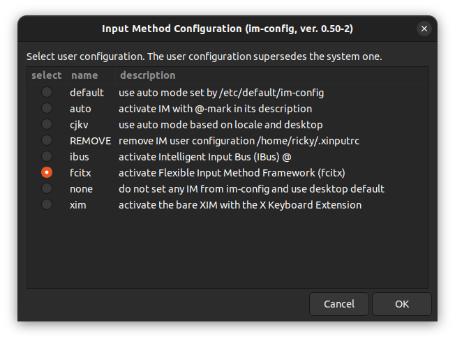
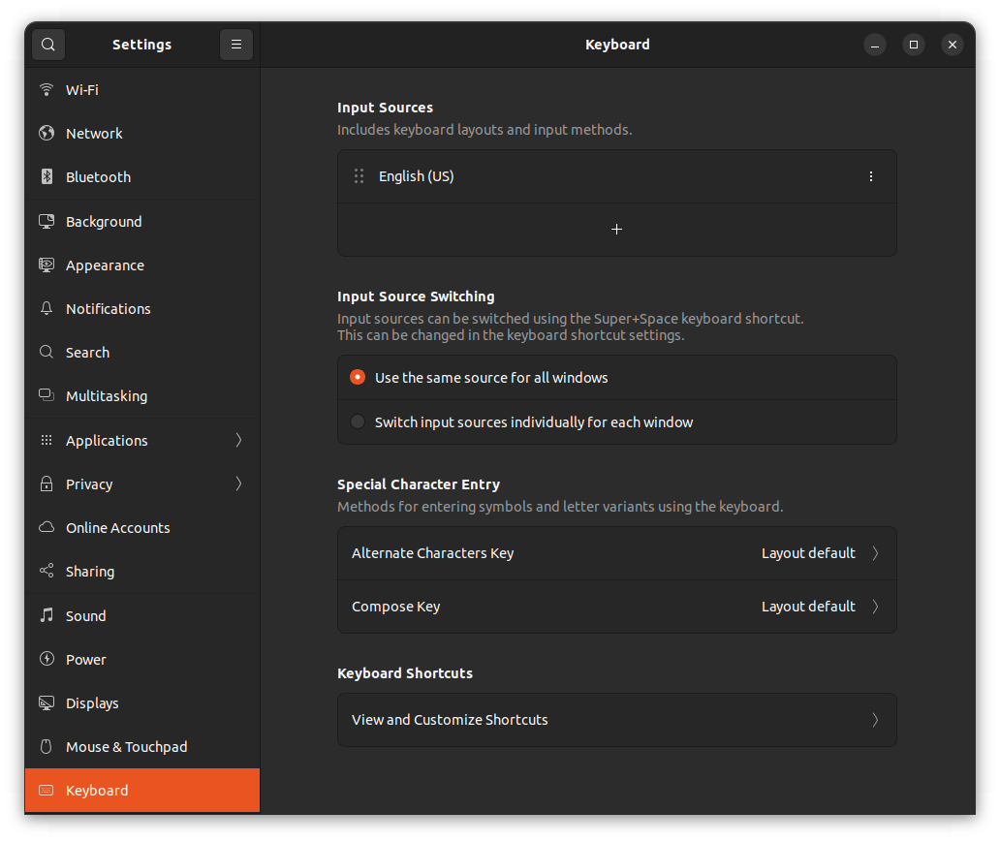
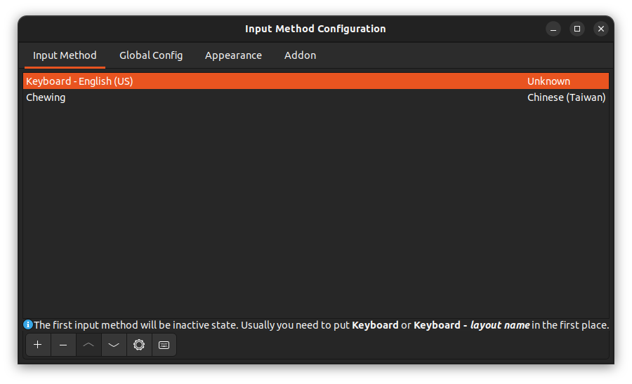

# Setup the input method for ubuntu
Change the input method from "ibus" to "fcitx" and install the Chewing(Chinese Zhuyin) input method to input the traditional chinese on ubuntu.

## Install fcitx and chewing
```sh
sudo apt install fcitx-bin
sudo apt install fcitx-chewing
```

## Set input method to fcitx
Use `im-config` to change the input method [from `ibus`] to `fcitx`.
```sh
im-config
```


## Remove other input method
Remove all the input sources except English(US)


## Setting the input method by fcitx manager
```sh
fcitx-configtool
```


# Reference
1. [Fcitx Chinese Pinyin Input Setup on Ubuntu](https://leimao.github.io/blog/Ubuntu-Gaming-Chinese-Input/)
2. [Fcitx Chinese Chewing Input Setup on Ubuntu](https://hackmd.io/@chiawei716/r1OPMS44H)
